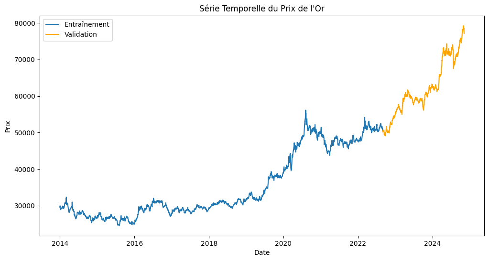

# 📈 Gold Price Forecasting using Time Series Analysis
This project aims to model and forecast gold prices using time series analysis techniques, including decomposition, stationarity tests, model fitting, residual analysis, and forecasting.

## Project Structure
The project includes the following stages:
1. **Data Preprocessing:** 
- Handling and formatting date columns
- Splitting dataset into training and validation sets
2. **Exploratory Data Analysis (EDA):**  
- Seasonal decomposition using ``statsmodels``
- ADF test for stationarity
- Differencing to achieve stationarity
3. **Model Selection:**
- ACF and PACF analysis
- Candidate model evaluation (e.g., ARIMA)
4. **Model Validation:**
- Residual analysis: ACF/PACF, Ljung-Box test, QQ-plot
- Forecast accuracy on validation data
5. **Forecasting:**
- Final prediction of future gold prices using validated models
## Dataset
The dataset includes historical gold prices with daily granularity. Preprocessing was applied to clean and prepare the data for time series modeling.

"# Gold-Price-Prediction" 
